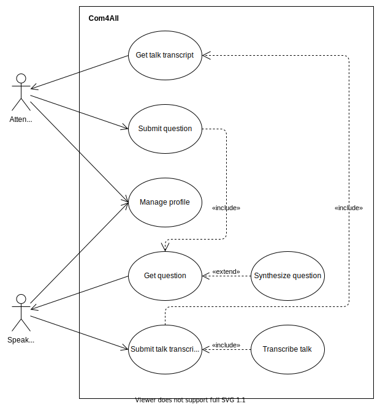

# open-cx-t2g4 Com4All


Welcome to the documentation pages of the *Com4All* of **openCX**!

You can find here detailed about the Com4All, hereby mentioned as module, from a high-level vision to low-level implementation decisions, a kind of Software Development Report, organized by discipline (as of RUP): 

* Business modeling 
  * [Product Vision](#Product-Vision)
  * [Elevator Pitch](#Elevator-Pitch)
* Requirements
  * [Use Case Diagram](#Use-case-diagram)
  * [User stories](#User-stories)
  * [Domain model](#Domain-model)
* Architecture and Design
  * [Logical architecture](#Logical-architecture)
  * [Physical architecture](#Physical-architecture)
  * [Prototype](#Prototype)
* [Implementation](#Implementation)
* [Test](#Test)
* [Configuration and change management](#Configuration-and-change-management)
* [Project management](#Project-management)

So far, contributions are exclusively made by the initial team, but we hope to open them to the community, in all areas and topics: requirements, technologies, development, experimentation, testing, etc.

Please contact us! 

Thank you!

Breno Pimentel  
Diogo Rodrigues  
L. Miguel Pinto  
Nuno Oliveira  

---

## Product Vision
Bring everyone to the conference sessions! Let the deaf hear and the mute speak through speech recognition and text synthesizing so no one is excluded.

---
## Elevator Pitch
In every conference there are two main elements: to listen and to see. But the former is not always possible due to hearing loss.  
The interaction between the audience and the speaker makes conferences alive, that's why whe created **Com4All**.

The **Com4All** is an app that enables communication, allowing one to keep track of the session through a real-time transcription of what is being said. It also allows the speaker to receive messages from the audience, translate them to a desired language and synthesize them for everyone to hear.

This solution's main advantages are that it is free and open-source, in addiction to being simple, fast, and light resource- and data-wise.

---
## Requirements

### Use case diagram 



#### Get talk transcript:
*  **Actor**. Attendee
*  **Description**. With this use case the attendee can follow and understand the speaker by reading the transcript of the talk.
*  **Preconditions and Postconditions**.  The attendee must have a valid profile and access to the conference. Then he can read the transcript of the speaker in the application.
*  **Normal Flow**. 
	1. The attendee selects the conference.
	2. The attendee reads the transcript with his phone.
	3. If the user desires, he can save and read the transcript afterwards.
*  **Alternative Flows and Exceptions**. 
	1. The attendee selects the conference.
	2. The attendee reads the transcript with his phone.
	3. The transcript do not load properly a warning pops up.
	4. The application is not able to transcript the audio a warning pops up.
    * **OR**
    1. The attendee selects the conference.
    2. If he does not have the access in this meeting, a warning pops up.

#### Submit question:
* **Actor:** Attendee
* **Description:** This use case exists so the attendee can submit questions to the speaker  
* **Preconditions and Postconditions:** In order to submit a question the attendee must be logged in and signed in a specific talk  
* **Normal Flow:**
  1. The attendee writes the question to the speaker and presses the button.
  2. The system stores the question on the server.
* **Alternative Flows and Exceptions:**
  1. The attendee writes the question to the speaker and presses the button.
  2. If the system can't connect to the server, a warning pops up system informs the attendee of the error

#### Manage profile:
* **Actor:** User
* **Description:** This use case exists so the user can see and manage his/her profile settings.
* **Preconditions and Postconditions:** In order to see his/her profile the user must be logged in.  
* **Normal Flow:**
  1. The user opens the profile settings.
  2. The user sees the profile settings.
  3. The user exits the profile settings.
  * **OR**
  1. The user opens the profile settings.
  2. The user changes one of the settings.
  3. The user saves the settings, sending them to the server.
  4. The user exits the profile settings.
* **Alternative Flows and Exceptions:**
  1. The user opens the profile settings.
  2. The user changes one of the settings.
  3. The user saves the settings, but if the device has no Internet connection a warning pops up.

#### Get question:
*  **Actor**. Speaker.
*  **Description**. This use case consists of receiving the question from a member of the audience in the database and converting it to speech (normally).
*  **Preconditions and Postconditions**. In order for this to happen, the speaker must be logged in talk's page. In the end, he can choose to simply read the question or have it be converted to speech.
*  **Normal Flow**. 
	1. The speaker is logged in.
	2. He gets a question and chooses to synthesize it.
	3. The audio corresponding to the question will play.
*  **Alternative Flows and Exceptions**. 
	1. The speaker gets a question and chooses not to synthesize it.
	* **OR**
	1. The speaker has some problem in his connection and a warning pops-up.
	
#### Submit talk transcript:
* **Actor**. Speaker
* **Description**. This use case exists so that the speaker's voice can be recorded, converted to text and the transcript uploaded to the database for the audience to read it.
* **Preconditions and Postconditions**. To have his voice transcribed, the speaker must be logged in, be in the talk's page, and have a working microphone. In the end, the speaker's voice transcript is added to the database.
* **Normal flow**.
    1. The speaker presses the button to start transcribing and uploading.
    2. The speaker gives the talk
    3. The speaker presses the button again to stop transcribing and uploading.
* **Alternative Flows and Exceptions**.
    1. The speaker presses the button to start transcribing and uploading.
    2. If the speaker has not spoken for some time, he is prompted to confirm he's still in a talk.
    3. If the speaker does not answer, or cancels, recording is stopped.
    4. If the speaker confirms, the recording continues as usual.
    * **OR**
    1. The speaker presses the button to start transcribing and uploading.
    2. If there is no Internet connection, or the connection drops, a warning pops up.

### User stories

**Must have**:
- [transcribe](#Story-"transcribe")
- [submit-question](#Story-"submit-question")
- [synthesize-question](#Story-"synthesize-question")

**Should have**:
- [delete-question](#Story-"delete-question")
- [accept-question](#Story-"accept-question")

**Could have**:
- [resize-transcript](#Story-"resize-transcript")
- [dark-mode](#Story-"dark-mode")
- [change-display-name](#Story-"change-display-name")
- [notes](#Story-"notes")
- [translate-transcript](#Story-"translate-transcript")


#### Story "transcribe"

As a speaker, I want my speech to be transcribed and sent to the attendees, so they can hear me

##### User interface mockup


##### Description
- The speaker has to authenticate to a session (through its session ID) using his authentication code (which is a short string like 1234)
- The speaker can leave the session chat by pressing the exit button on the top left.

##### Acceptance Tests
```Gherkin
Scenario: Transcribing speech  
	When I press the record button
  And I say "Hello world"
	Then "Hello world" is sent to all attendees  
```
	
##### Value and Effort
Value:  Must-Have  
Effort: XL  

#### Story "submit-question"

As a conference attendee who can't speak, I want to be able to easily submit text questions to the speaker, so I can better understand the talk subjects

##### User interface mockup


##### Acceptance Tests
```Gherkin
Scenario: Asking a question  
	When I write the question  
	And I press the submit button  
	Then The server must put my question on the queue  
```
	
##### Value and Effort
Value:  Must-Have  
Effort: XL  

#### Story "synthesize-question"
As the speaker I want to select a specific question and have it synthesized

##### User interface mockup


##### Acceptance tests
```gherkin
Scenario: Synthesizing a question
  When there are X unanswered questions
  And the speaker chooses a question to synthesize
  Then question is indeed synthesized and audio is played
```

##### Value and effort
Value: Must Have
Effort: XL

#### Story "delete-question"
As the speaker I want to delete a question after it has been answered (or not)

##### User interface mockup


##### Acceptance tests
```gherkin
Scenario: Deleting a question
  When there is a question the speaker wants to delete for any reason
  And the speaker chooses to delete the question
  Then question is removed from the database
```

**Value and effort**
Value: Must Have
Effort: XL

#### Story "resize-transcript"

As a user of the application, I want to change the height of the transcript/questions sections so I can read all questions, or focus on the transcript.

##### User interface mockup


##### Acceptance tests
```gherkin
Scenario: Attending in a conference
  When I drag the transcript/separation up or down
  Then The separation moves up and down
  And  The sections are resized accordingly
```

##### Value and Effort
Value:  Should have  
Effort: S

#### Story "accept-question"

As a speaker, I want to be able to notify my audience on whether I will answer a question or not.

##### User interface mockup


##### Acceptance tests
```gherkin
Scenario: Accept question
  When I tap the check mark of question "Hello, I have a question"
  Then The background of question "Hello, I have a question" changes to green
Scenario: Reject question
  When I tap the cross mark of question "Hello, I have a question"
  Then The background of question "Hello, I have a question" changes to red
```

##### Value and Effort
Value: Should have  
Effort: L

#### Story "dark-mode"

As a user in a conference, I want to be able to change the app theme to dark mode.

##### User interface mockup


##### Acceptance tests
```gherkin
Scenario: Enable dark mode
  When I enable dark mode
  Then the app shows in dark mode
  And  dark mode persists
```

##### Value and Effort
Value:  Should have  
Effort: M

#### Story "change-display-name"

As a user in a conference, I want to be able to change my Display Name so others can more easily recognize me or so I am showing my favorite name.

##### User interface mockup


##### Acceptance tests
```gherkin
Scenario: Change display name
  When I edit my display name
  And  I press the save button
  Then My display name is saved in my device
  And  My display name is updated in the server
```

##### Value and Effort
Value:  Could have  
Effort: M

#### Story "notes"

As an attendee in a conference, I want to be able to take notes and highlights of the speaker presentation in my device so that I can search than later.

##### User interface mockup


##### Acceptance tests
```gherkin
Scenario: Taking notes in the conference
  When I write my note or highlighted part of the transcription
  And I press the save button
  Then The text is marked and I can consult it later
```

##### Value and Effort
Value:  Could have  
Effort: S

#### Story "translate-transcript"

As an attendee in a conference, I want to understand what is being said even if I don't know the speaker's language.

##### User interface mockup


##### Acceptance tests
```gherkin
Scenario: Attending in a conference
  When I can't speak the language spoken
  And  I select the language I want to be transcribed
  Then I get the transcript with my language of choice
```

##### Value and Effort
Value:  Could have  
Effort: M

### Domain model


Our app consists of Users(Atendee or Speaker) and its devices, Conferences and Messages.  
Both Atendees and Speakers are Users. Each user has its own device. 
Each Conference has one speaker and multiple atendees who can send messages related to a conference such as questions. One message can only be sent by one device/user(only atendees can send messages) and can only target one conference. Each conference has a transcript which is updated by the Speaker responsible for the conference. 

---

## Architecture and Design

### Logical architecture


The application is structured by four main packages:
* Synthesizer: responsible for the synthesizing mechanisms
* Transcriber: responsible for the transcriber mechanisms
* Database: used to manage the database
* Messaging: used to subscribe attendees and send messages in both directions

### Physical architecture


In this project we used the Flutter framework, following the suggestion of the professors, as it have many built-in features and public packages. For the dependencies we used [speech_to_text](https://pub.dev/packages/speech_to_text) in the transcriber and [flutter_tts](https://pub.dev/packages/flutter_tts) fot the text to speech feature. We also opted for Firebase for our database server because of its simple setup. The Com4All app connects with the database everytime it needs to send or receive messages.

### Prototype

To help on validating all the architectural, design and technological decisions made, we implemented a thin vertical slice of the system.

We created a structure where we could verify the possibility of the two main features: transcription and question synthesizing. Both were implemented locally and we could test which modules were more suitable for this purposes.

---

## Implementation

Changelogs for the 4 different product increments can be found [here](https://github.com/FEUP-ESOF-2020-21/open-cx-t2g4-bits-please/releases)

---
## Test

To ensure the quality of the application, we performed acceptance tests and unit tests. GitHub Actions was used to automate our unit tests.

### Acceptance tests:
This tests were made with Flutter Gherkin.
The features tested are:
* [Joining a session](https://github.com/FEUP-ESOF-2020-21/open-cx-t2g4-bits-please/blob/main/src/test_driver/features/join_session.feature)
* [Asking a question](https://github.com/FEUP-ESOF-2020-21/open-cx-t2g4-bits-please/blob/main/src/test_driver/features/ask_question.feature)

### Unit tests:
We made unit tests for the most important packages of the application using flutter tools:
* Synthesizer: verify if the `text to speech` functionality is working
* Transcriber: verify if the `speech to text` functionality is working

---
## Configuration and change management

In order to maintain the integrity of our project's artifacts, configuration and change management are key activities.

To manage feature requests, bug fixes, and improvements, we used GitHub issues following the [GitHub flow](https://guides.github.com/introduction/flow/).

---

## Project management

### User Story Map


To plan and manage our project we used the Github Projects tool:
[Github Projects](https://github.com/FEUP-ESOF-2020-21/open-cx-t2g4-bits-please/projects/2)

---

## Evolution - contributions to open-cx

Not yet done.
